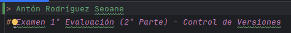
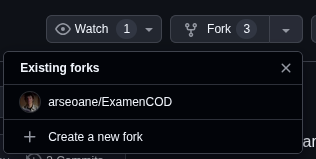
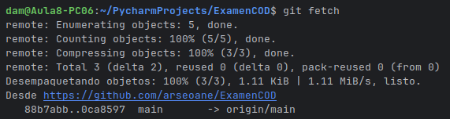
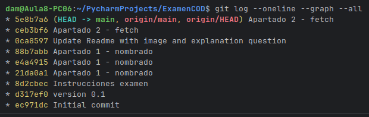

> Antón Rodríguez Seoane
> Ayer me comí una empanada
# Examen 1ª Evaluación (2ª Parte) - Control de Versiones

---

## Instrucciones
- Los commits de cada apartado deben tener el mensaje *"Apartado X - descripción del cambio realizado"*
- Entrega en la tarea de Moodle tu repositorio
- Solo se corrigen los commits que estén en el repositorio remoto

### Apartado 1

- Clona este repositorio.
- Modifica este Readme, poniendo tu nombre completo, realiza un `commit` con el mensaje *"Apartado 1"* y un `push`.

- 
Pregunta 
- ¿Qué paso es fundamental cuando clonamos un repositorio ajeno para que podamos subir nuestros propios commits? Explícalo y utiliza capturas de pantalla.

Es fundamental crear un fork.

### Apartado 2

- Realiza una modificación en el código en la web de tu repositorio en GitHub
- Utiliza fetch para descargar los cambios realizados en tu repositorio.

Pregunta
- Explica los pasos para que el código modificado en GitHub, llegue a tu rama principal local. Explícalo con capturas de pantalla.

Se ejecutan estos comandos:

Luego para comprobar, se usa:

### Apartado 3

- Realiza otro cambio desde la web de tu repositorio en GitHub.
- Utiliza pull para descargar los cambios realizados en tu repositorio.

Pregunta
- Explica los pasos dados para que el cambio realizado en GitHub, llegue a tu rama principal local. Explícalo con capturas de pantalla.

